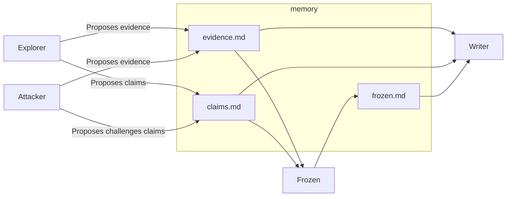
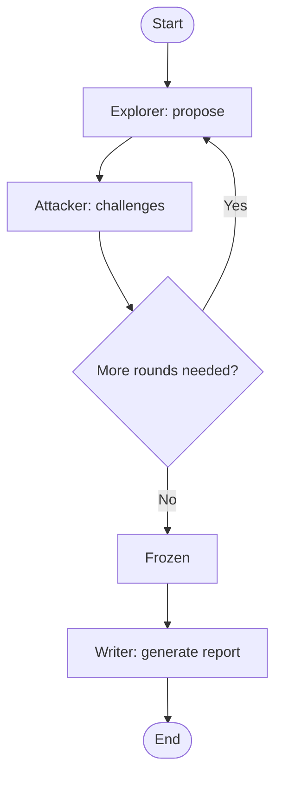

# CLAIM

CLAIM (Claim-Led Adversarial Investigation by Multi-agent) is a structured investigation methodology for exploring unknown systems and producing highly credible technical reports. It is designed not for creativity, but for traceable and auditable conclusions.

## What is this methodology for?

CLAIM is designed to:

* Make all technical conclusions explicit as Claims.
* Ensure each Claim is backed by verifiable evidence.
* Use an adversarial, round-based process to validate Claims.
* Produce a readable and reliable technical report.

In short, it helps you generate a trustworthy, evidence-based research report from a system.

## When should you use it?

Use CLAIM whenever you need to analyze or understand an unknown system but:

* You cannot fully trust a single explanation (human or LLM).
* You need to ensure the credibility of the final report.
* Example use cases: onboarding a new project, auditing third-party code, or investigating complex workflows.

## Why is it needed?

* LLMs are prone to hallucinations and errors.
* Humans also make mistakes or overlook subtle issues.
* CLAIM provides a structured, traceable process to minimize blind spots and ensure evidence-backed conclusions.

## How does it work?

CLAIM follows a round-based, adversarial workflow with multiple agents:



* Explorer – searches for new evidence and proposes claims
* Attacker – challenges claims and proposes counter-claims
* Frozen – decides when claims have sufficiently converged (frozen)
* Writer – produces a human-readable technical report based on frozen claims



* Orchestrator (optional) – coordinates rounds and agent interactions

Each agent leaves append-only records in the corresponding memory files. This ensures controlled information flow between agents and maintains traceability, while acknowledging that neither humans nor LLMs are 100% accurate.

These files allow full traceability, so any errors can be traced back to misleading variables, misused data structures, or other common confusion factors.

For full agent details and prompt definitions example, see `.gemini/commands/{prompt}.toml`. For orchestration logic example, see `orchestrator.sh`.

## Who can act as the agents?

Agents can be humans, deterministic scripts, LLMs, prompts, or sub-agents.
The only requirement is that information flow and responsibilities are preserved, and agents cannot communicate outside the shared memory files.

## Why do we need the "Frozen" Agent?

In a typical Multi-agent system, LLMs often fall into an infinite loop of politeness or recursive hallucination. When you ask an LLM if it's sure, it will almost always find something new to change or hallucinate a nuance just to satisfy the prompt.

## Showcase: From Legacy Code to Hidden Logic

CLAIM has been tested against two distinct, real-world challenges to demonstrate its robustness.

### Example 1: Knowledge Reconstruction (Legacy Codebase)

Target:
```
Explain how the rankNet_bert project works so that a new engineer can understand and maintain it.
```

The [rankNet_bert](https://github.com/avengerandy/rankNet_bert) project is one of my side projects with zero documentation, which lacks a README.md and detailed comments.

This situation is not unique: many legacy codebases and older internal projects suffer from the same issues, making knowledge transfer and long-term maintenance difficult.

When facing a complex legacy project, a single LLM prompt often yields a shallow, generic overview. CLAIM handles this by treating the codebase like an archaeological site.

* The explorer: mapped out the training pipeline and BERT integration.
* The attacker: questioned the data flow, forcing the discovery of specific preprocessing steps that weren't obvious.
* The result: A comprehensive report that serves as an instant onboarding guide for new engineers.

You can inspect all files in the `memory_legacy_case/` folder, including `evidence.md`, `claims.md`, `frozen.md`, and the [final research report](https://github.com/avengerandy/claim/blob/master/memory_legacy_case/research.md).

### Example 2: Bias Correction (The "Anti-Pattern" Trap)

Target:

```
Is the following solution able to correctly solve this problem? Please investigate whether it is functional or not, and explain the reasons behind your conclusion.

695. Max Area of Island
Medium
Topics
premium lock iconCompanies

You are given an m x n binary matrix grid. An island is a group of 1's (representing land) connected 4-directionally (horizontal or vertical.) You may assume all four edges of the grid are surrounded by water.

The area of an island is the number of cells with a value 1 in the island.

Return the maximum area of an island in grid. If there is no island, return 0.


Example 1:

Input: grid = [[0,0,1,0,0,0,0,1,0,0,0,0,0],[0,0,0,0,0,0,0,1,1,1,0,0,0],[0,1,1,0,1,0,0,0,0,0,0,0,0],[0,1,0,0,1,1,0,0,1,0,1,0,0],[0,1,0,0,1,1,0,0,1,1,1,0,0],[0,0,0,0,0,0,0,0,0,0,1,0,0],[0,0,0,0,0,0,0,1,1,1,0,0,0],[0,0,0,0,0,0,0,1,1,0,0,0,0]]
Output: 6
Explanation: The answer is not 11, because the island must be connected 4-directionally.

Example 2:

Input: grid = [[0,0,0,0,0,0,0,0]]
Output: 0


Constraints:

    m == grid.length
    n == grid[i].length
    1 <= m, n <= 50
    grid[i][j] is either 0 or 1.

class Solution:
    def maxAreaOfIsland(self, grid: List[List[int]]) -> int:
        self.grid = grid
        ans = 0
        for i in range(len(self.grid)):
            for j in range(len(self.grid[i])):
                if self.grid[i][j] == 1:
                    area = self.dfs(i, j, 2) - 2
                    ans = max(area, ans)

        return ans

    def dfs(self, i: int, j: int, step: int) -> int:
        if i < 0 or j < 0:
            return step
        if i > len(self.grid) - 1 or j > len(self.grid[0]) - 1:
            return step
        if self.grid[i][j] != 1:
            return step
        self.grid[i][j] = step
        step = step + 1
        step = self.dfs(i + 1, j, step)
        step = self.dfs(i - 1, j, step)
        step = self.dfs(i, j + 1, step)
        return self.dfs(i, j - 1, step)
```

Standard LLMs often suffer from Pattern Bias — if code looks wrong or non-idiomatic, they hallucinate errors that aren't there. In this case, the solution used a `step` variable passed through recursive calls as a relay to count area.

<p align="center">
  
  
  <br>
  <em>Standard LLMs confidently providing incorrect analysis due to pattern bias.</em>
</p>

* The explorer: In the first round, the explorer (and most LLMs) incorrectly claimed the code was broken, arguing that local variables can't accumulate area.
* The attacker: refused to accept the common sense answer. It performed a deep trace and proved that the chained assignment (`step = self.dfs(..., step)`) creates a valid global-like counter.
* The result: CLAIM produced an accurate report where a single-turn chat would have failed, proving its ability to eliminate AI hallucinations through adversarial rigor.

```
This report details the investigation into a provided Python solution for the LeetCode problem "695. Max Area of Island". The primary objective was to determine if the submitted solution is correct and to provide a clear explanation of its methodology.

The analysis concluded that **the solution is functionally correct**, though it employs an unconventional and potentially confusing implementation for calculating the area of an island.
```

You can inspect all files in the `memory_logic_trap_case/` folder, including `evidence.md`, `claims.md`, `frozen.md`, and the [final research report](https://github.com/avengerandy/claim/blob/master/memory_logic_trap_case/research.md).

## Inspiration

CLAIM is inspired by techniques in reinforcement learning (e.g., actor-critic methods) and iterative optimization from multiple perspectives (e.g., Expectation-Maximization, Gibbs Sampling).

By restricting permissions and fixing agent responsibilities, CLAIM simplifies the investigation workflow while maintaining rigorous, auditable results.

## License

The source code in this repository is licensed under the MIT License.

See [LICENSE-CODE](https://github.com/avengerandy/claim/blob/master/LICENSE-CODE) for details.

The documentation, methodology, and written content are licensed under
the Creative Commons Attribution-ShareAlike 4.0 International License (CC BY-SA 4.0).

See [LICENSE](https://github.com/avengerandy/claim/blob/master/LICENSE) for details.
