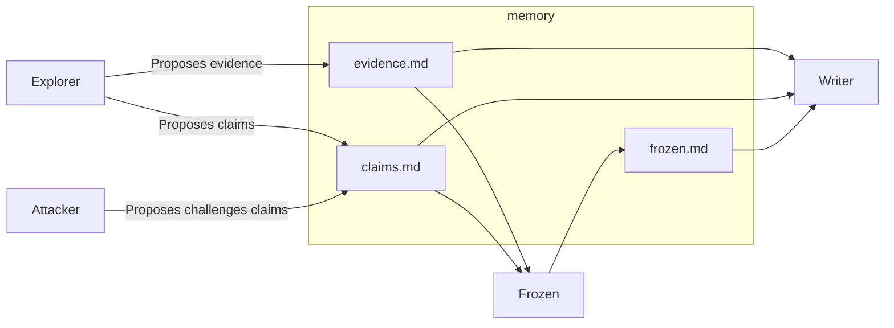

# CLAIM

CLAIM (Claim-Led Adversarial Investigation by Multi-agent) is a structured investigation methodology for exploring unknown systems and producing highly credible technical reports. It is designed not for creativity, but for traceable and auditable conclusions.

## What is this methodology for?

CLAIM is designed to:

* Make all technical conclusions explicit as Claims.
* Ensure each Claim is backed by verifiable evidence.
* Use an adversarial, round-based process to validate Claims.
* Produce a readable and reliable technical report.

In short, it helps you generate a trustworthy, evidence-based research report from a system.

## When should you use it?

Use CLAIM whenever you need to analyze or understand an unknown system but:

* You cannot fully trust a single explanation (human or LLM).
* You need to ensure the credibility of the final report.
* Example use cases: onboarding a new project, auditing third-party code, or investigating complex workflows.

## Why is it needed?

* LLMs are prone to hallucinations and errors.
* Humans also make mistakes or overlook subtle issues.
* CLAIM provides a structured, traceable process to minimize blind spots and ensure evidence-backed conclusions.

## How does it work?

CLAIM follows a round-based, adversarial workflow with multiple agents:



* Explorer – searches for new evidence and proposes claims
* Attacker – challenges claims and proposes counter-claims
* Frozen – decides when claims have sufficiently converged (frozen)
* Writer – produces a human-readable technical report based on frozen claims


* Orchestrator (optional) – coordinates rounds and agent interactions

Each agent leaves append-only records in the corresponding memory files. This ensures controlled information flow between agents and maintains traceability, while acknowledging that neither humans nor LLMs are 100% accurate.

These files allow full traceability, so any errors can be traced back to misleading variables, misused data structures, or other common confusion factors.

For full agent details and prompt definitions example, see `.gemini/commands/{prompt}.toml`. For orchestration logic example, see `orchestrator.sh`.

## Who can act as the agents?

Agents can be humans, deterministic scripts, LLMs, prompts, or sub-agents.
The only requirement is that information flow and responsibilities are preserved, and agents cannot communicate outside the shared memory files.

## Example

This repository includes a complete example run. The investigation target for this run was:

```
Explain how the rankNet_bert project works so that a new engineer can understand and maintain it.
```

The [rankNet_bert](https://github.com/avengerandy/rankNet_bert) project is one of my side projects, which lacks a README.md and detailed comments.

This situation is not unique: many legacy codebases and older internal projects suffer from the same issues, making knowledge transfer and long-term maintenance difficult.

This example demonstrates how CLAIM can generate a technical report to help a new engineer understand and maintain such projects.

You can inspect all files in the `memory/` folder, including `evidence.md`, `claims.md`, `frozen.md`, and the [final research report](https://github.com/avengerandy/claim/blob/master/memory/research.md).

## Inspiration

CLAIM is inspired by techniques in reinforcement learning (e.g., actor-critic methods) and iterative optimization from multiple perspectives (e.g., Expectation-Maximization, Gibbs Sampling).

By restricting permissions and fixing agent responsibilities, CLAIM simplifies the investigation workflow while maintaining rigorous, auditable results.

## License

Source code is licensed under the MIT License.

[LICENSE-CODE](https://github.com/avengerandy/claim/blob/master/LICENSE-CODE)

Documentation, methodology, and written content are licensed under the Creative Commons Attribution-ShareAlike 4.0 International License (CC BY-SA 4.0).

[LICENSE](https://github.com/avengerandy/claim/blob/master/LICENSE)
